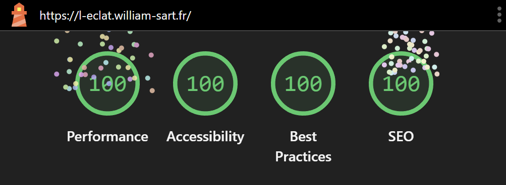

<div align="center">

  
  <br/>

  # Pressing L'Éclat
  
  **Site vitrine ultra-performant pour un commerce local Premium**
  
  [](https://l-eclat.william-sart.fr)
  [](https://pagespeed.web.dev/)

  <p>
    <a href="https://l-eclat.william-sart.fr"><strong>Voir le site en direct »</strong></a>
    <br/>
    <br/>
    <a href="#-stack-technique">Stack Technique</a> ·
    <a href="#-performance--qualité">Performance</a>
  </p>

</div>

---

## 📝 À propos du projet

**L'Éclat** est un projet de démonstration simulant la présence numérique d'un pressing écologique haut de gamme. L'objectif était de concevoir un site **statique, accessible et performant**, sans sacrifier le design visuel.

L'identité visuelle **"Stone & Amber"** (Pierre et Or) a été conçue sur-mesure pour évoquer l'artisanat de luxe, loin des standards cliniques habituels.

## 🚀 Performance & Qualité

Ce projet vise l'excellence technique. Audit Google Lighthouse : **Score parfait 100/100**.

| Catégorie | Score | Optimisations Réalisées |
| :--- | :---: | :--- |
| 🟢 **Performance** | **100** | Images WebP locales, Self-hosting des polices, Cache .htaccess, Minification |
| 🟢 **Accessibilité** | **100** | Contrastes WCAG AA, Navigation clavier, Labels ARIA |
| 🟢 **Best Practices** | **100** | HTTPS strict (HSTS), Zéro cookies tiers, CSP |
| 🟢 **SEO** | **100** | Méta-données dynamiques, OpenGraph, Structure sémantique HTML5 |

<div align="center">
    
    <br/>
</div>

## 🛠 Stack Technique

Architecture **Jamstack** moderne pour une sécurité et une rapidité maximales.

| Technologie | Usage | Badge |
| :--- | :--- | :--- |
| **Astro** | Framework Web |  |
| **Tailwind CSS** | Styling & Design System |  |
| **JavaScript** | Micro-interactions |  |
| **o2switch** | Hébergement (Apache) |  |

## ✨ Fonctionnalités Clés

* ⚡ **Zero-JS by default :** Le site charge du HTML pur. Le JS ne s'active que pour le menu mobile (Island Architecture).
* 🎨 **Design System :** Palette de couleurs personnalisée et typographie `Playfair Display` & `Lato` auto-hébergée.
* 📱 **100% Responsive :** Grilles adaptatives et menu mobile fluide.
* 🗺️ **Carte Optimisée :** Remplacement de l'iframe Google Maps par une image statique interactive (gain de performance énorme).
* 🔒 **Confidentialité :** Aucun cookie de tracking, respect total du RGPD.

## 📂 Structure du Projet

```bash
/
├── public/          # Fichiers statiques (Images, robots.txt)
├── src/
│   ├── components/  # Composants réutilisables (Header, Footer)
│   ├── layouts/     # Mise en page globale (SEO, Styles globaux)
│   └── pages/       # Pages du site (index, tarifs, services...)
├── astro.config.mjs # Configuration du framework
└── tailwind.config.mjs # Configuration du design
```

<div align="center"> Développé avec le ❤️ par William Sart.</div>